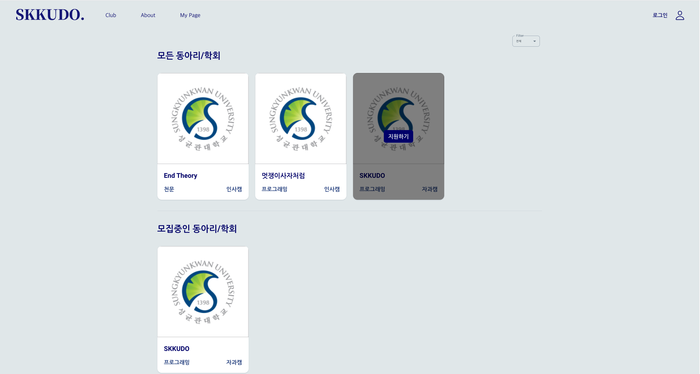
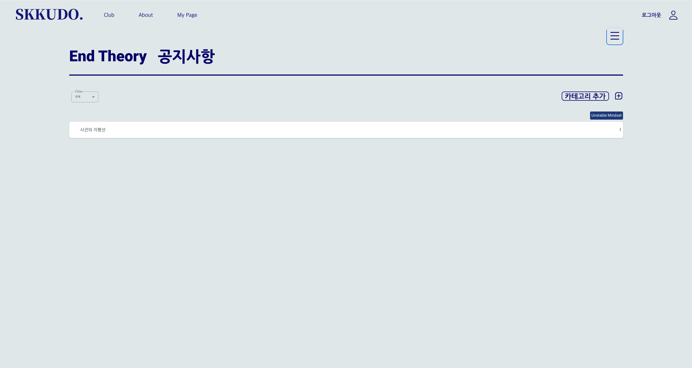
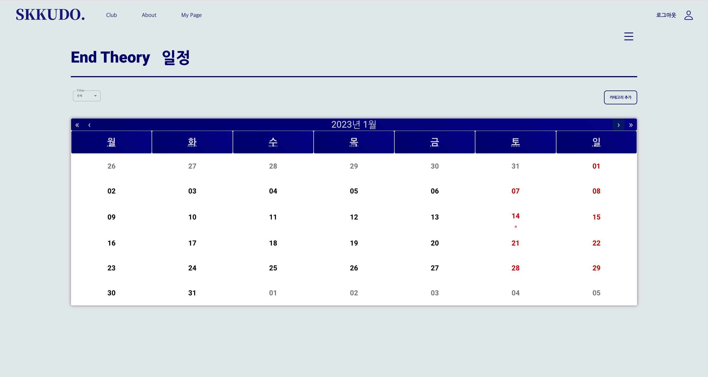
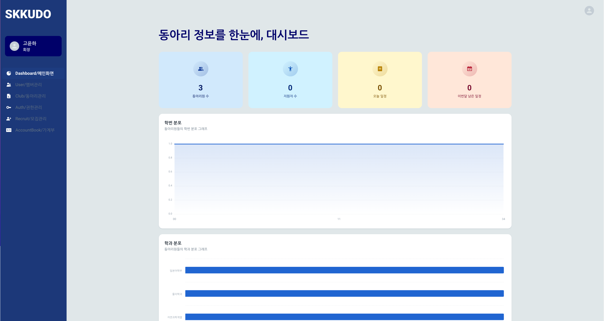

# SKKUDO - 성균관대학교 동아리 관리 플랫폼

visit [SKKUDO](https://www.skkudo.link/) and try awesome features!

 
SKKUDO is a platform for SKKU clubs.

- Look around clubs in SKKU and apply via online
- Check out your club's latest schedule and notices in one place
- Manage your clubs easily

 
 
 

### Start your journey with SKKUDO

 

Browse all clubs in SKKUDO. Clubs that are recruiting are viewed separately to help you!

 

### You just have to enjoy

 

SKKUDO won't let you miss the club's latest information.  
Notices, schedule, information about club memebers are easily visible in SKKUDO.

 

### Make yourself at SKKUDO

 

Managing a club is now your spcialty.  
Customize your clubs with various settings that SKKUDO provides.

Checkout the [SKKUDO website](https://www.skkudo.link/) to see more!
